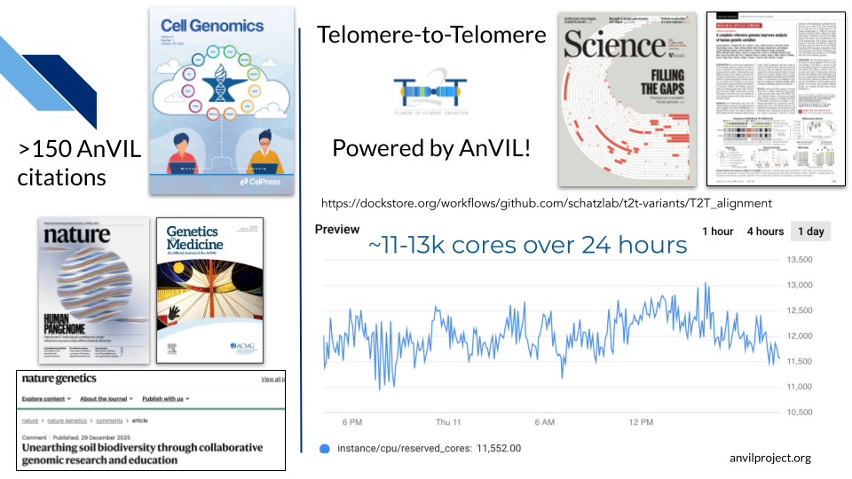
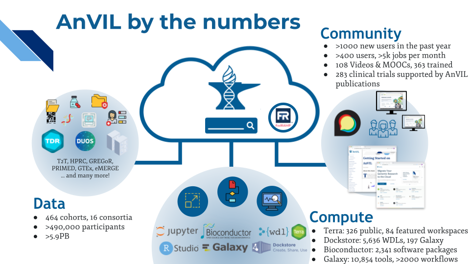
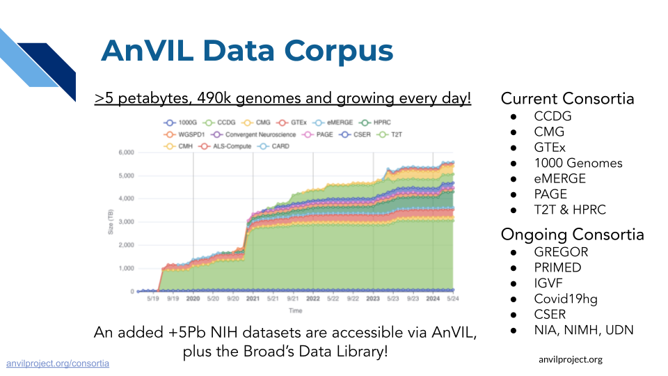
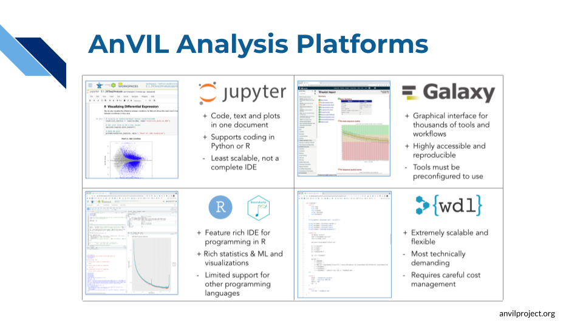
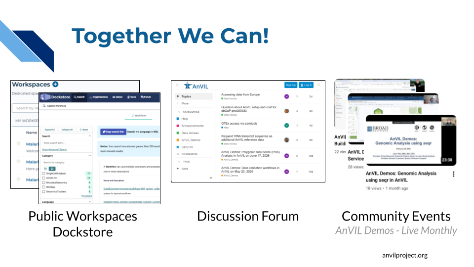

# What is AnVIL?

[AnVIL](https://anvilproject.org/) is NHGRI's Genomic Data Science Analysis, Visualization, and Informatics Lab-Space. AnVIL inverts the traditional model of genomic data science by **bringing analysis to the data**, rather than downloading data for local analysis. By providing a secure, unified environment for data management and compute, AnVIL eliminates the need for data movement, allows for active threat detection and monitoring, and provides elastic, shared computing resources that can be acquired as needed.

<iframe width="560" height="315" src="https://www.youtube.com/embed/XC5qzj-yZb8?si=eq_Z0QfgH2LLAeGF" title="YouTube video player" frameborder="0" allow="accelerometer; autoplay; clipboard-write; encrypted-media; gyroscope; picture-in-picture; web-share" referrerpolicy="strict-origin-when-cross-origin" allowfullscreen></iframe>

## Who uses AnVIL?

AnVIL powers a wide range of projects, from [building a more complete human genome](https://doi.org/10.1126/science.abl3533) to supporting [research that forms the basis for clinical trials](https://through.bio/anvil) to [bringing bioinformatics research to undergraduate classrooms](https://www.nature.com/articles/s41588-025-02442-5).

These efforts are made possible by AnVIL’s ability to provide computational power and tools exactly when and where they’re needed. You can learn more about research powered by AnVIL at [anvilproject.org/explore/citations](https://anvilproject.org/explore/citations).

## Components of AnVIL

So, what exactly is AnVIL? AnVIL comprises 3 pillars that together enable secure, robust, collaborative genomic data science: **data**, **compute**, and **community**.

### Data

AnVIL provides secure access to >5 petabytes of data, spanning hundreds of datasets and >490,000 participants. Users are also free to bring their own data into their projects.

- **High value datasets**: AnVIL hosts many [consortia](https://anvilproject.org/consortia) datasets, including eMERGE, ALS, and GTEx.
- **Discoverable**: Through the [AnVIL Data Explorer](https://explore.anvilproject.org/datasets) you can browse or search for datasets based on many different facets, such as Diagnosis or Anatomical Site, as well as Consent Group or File Type.
- **Secure**: The AnVIL platform comes with built-in data access controls to help researchers ensure they maintain appropriate security measures while working with controlled-access data.
  - AnVIL's datasets and compute infrastructure are secured in accordance with the industry best practices, the NIST 800-53 Moderate security controls following the FedRAMP standard.
  - AnVIL is recognized by the NIH as a Controlled-Access Data Repository (CADR) that meets NIH’s Required Security and Operational Standards for NIH Controlled-Access Data Repositories (NOT-OD-25-159).
  - Learn more about [AnVIL’s Platform and Data Security](https://anvilproject.org/overview/security).

The [Data on AnVIL webbook](https://hutchdatascience.org/Data_on_AnVIL/) provides detailed walkthroughs of how to access and/or import data on AnVIL.

### Compute

Powered by the Terra platform, AnVIL provides many common genomics tools "out of the box". Anvil users can also import and share additional tools of their own choosing.

- **Jupyter** and **RStudio** (with **BioConductor**) environments can be launched with the click of a button for easy access to interactive analysis tools. Users can install additional software as needed.
- **Galaxy** on AnVIL combines the power of Galaxy with the security of AnVIL, providing a safe place to run Galaxy-based analyses on controlled-access data.
- **WDL workflows** enable scalable analysis pipelines. Through [Dockstore](https://dockstore.org/), researchers can share and reuse workflows, facilitating reproducible research.

### Community

AnVIL empowers the scientific community by facilitating sharing of data and tools, and by fostering communication between users of those data and tools.

- **Public Workspaces** and **Dockstore** enable AnVIL users to share data, pipelines, and results with the broader community.
- Through the [**community support forum**](https://help.anvilproject.org/), AnVIL users can interact with each other and the AnVIL team.
- **Community events** (both virtual and in person), such as monthly [AnVIL Demos](https://training.anvilproject.org/demos.html) and the annual [AnVIL Community Conference](https://training.anvilproject.org/acc.html), showcase work being done on AnVIL and provide opportunities for members of the AnVIL community to connect.
  - See [anvilproject.org/events](https://anvilproject.org/events) for upcoming events.
