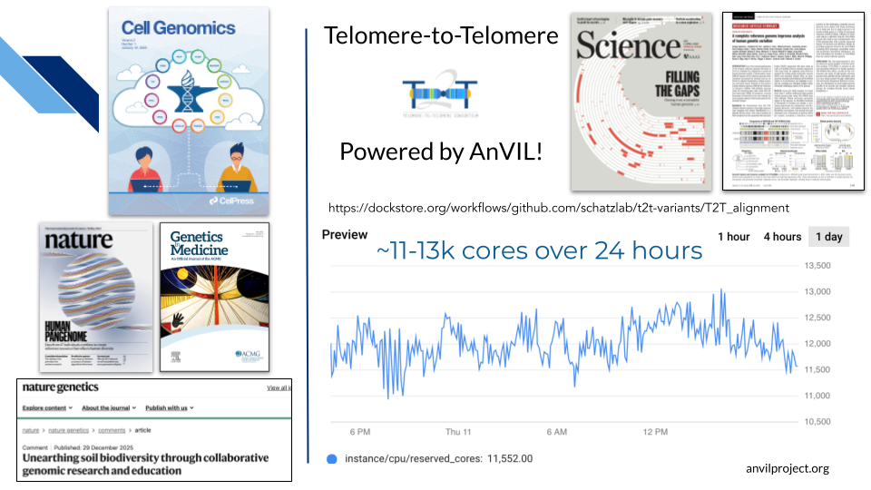

# What is AnVIL?

[AnVIL](https://anvilproject.org/) is NHGRI's Genomic Data Science Analysis, Visualization, and Informatics Lab-Space. AnVIL inverts the traditional model of genomic data science by **bringing analysis to the data**, rather than downloading data for local analysis. By providing a secure, unified environment for data management and compute, AnVIL eliminates the need for data movement, allows for active threat detection and monitoring, and provides elastic, shared computing resources that can be acquired as needed.

<iframe width="560" height="315" src="https://www.youtube.com/embed/XC5qzj-yZb8?si=eq_Z0QfgH2LLAeGF" title="YouTube video player" frameborder="0" allow="accelerometer; autoplay; clipboard-write; encrypted-media; gyroscope; picture-in-picture; web-share" referrerpolicy="strict-origin-when-cross-origin" allowfullscreen></iframe>

AnVIL powers a wide range of projects, from [building a more complete human genome](https://doi.org/10.1126/science.abj6987) to supporting clinical trials to [bringing bioinformatics research to undergraduate classrooms](https://www.nature.com/articles/s41588-025-02442-5).

These efforts are made possible by AnVIL’s ability to provide computational power and tools exactly when and where they’re needed.

So, what exactly is AnVIL? AnVIL comprises 3 pillars that together enable secure, robust, collaborative genomic data science: **data**, **compute**, and **community**.

## Data

## Compute

## Community
