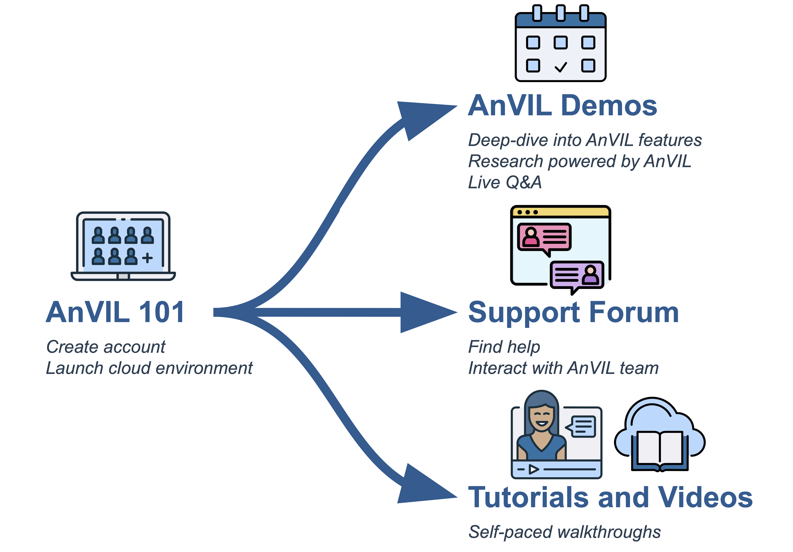

# About this Book {-}

Welcome to AnVIL 101! This book is part of a collection of resources for the Genomic Data Science Analysis, Visualization, and Informatics Lab-space (AnVIL) of the National Human Genome Research Institute (NHGRI). Learn more about AnVIL by visiting https://anvilproject.org or reading the [article in Cell Genomics](https://www.sciencedirect.com/science/article/pii/S2666979X21001063).

{width=70% fig-align="center"}

This book is a companion to the [virtual AnVIL101 workshop](https://training.anvilproject.org/anvil101.html), containing a walkthrough of the material. You can work through this book on your own, or you can:

- Join us for an [upcoming workshop](https://training.anvilproject.org/anvil101.html)
- Watch a [recording](https://www.youtube.com/watch?v=LKoOEpA8NMk) of a past workshop

## Who is AnVIL 101 for? {-}

AnVIL 101 gives a brief tour of the AnVIL ecosystem and walks through the basics of setting up a compute environment on AnVIL. **If you have never used AnVIL before, this is a great place to start!**

If you have previously set up your AnVIL account and started up an interactive computing environment (Jupyter, RStudio, or Galaxy), then you may be more interested in other materials, such as our monthly [virtual AnVIL Demos](https://training.anvilproject.org/demos.html) which dive deeper into how people use AnVIL for research. Check out the [AnVIL Training website](https://training.anvilproject.org/) to learn more about other training opportunities.

::: {.warning}
This book walks you through the basics of using AnVIL, which requires you to have an active Billing Project to pay for the computing resources that you use. **If you join us for a [live AnVIL 101 virtual workshop](https://training.anvilproject.org/anvil101.html), we will take care of the Billing Project for you.**

The beginning chapters, which give an overview of AnVIL, can be done without an AnVIL account or Billing Project. 
:::

## Skills Level {-} 

::: {.notice}
_Genetics_

**Novice**: no genetics knowledge needed

_Programming skills_

**Novice**: no programming experience needed
:::

## AnVIL Training {-}

Please check out [training.anvilproject.org](https://training.anvilproject.org/) for additional learning opportunities and related resources.

<!-- ## Learning Objectives {-} -->

